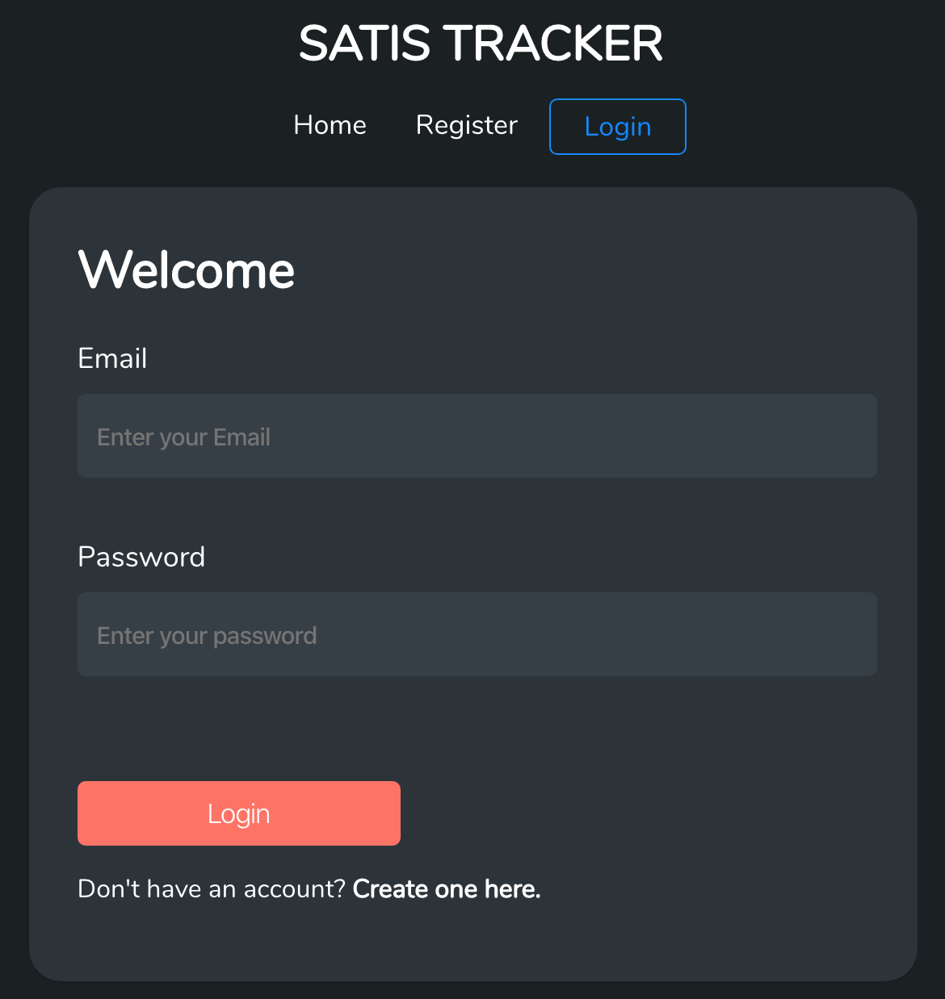

# Satis Tracker
### By Luis Riveron

# Live At (Deployed)
[https://satistracker.com/](https://satistracker.com/)

Satis Tracker is a web application for keeping track of daily work satisfaction.

After creating an account and logging in, users set their work schedule which includes:
- Work start hour
- Work end hour
- Work days during the week

Users are encouraged to login everyday at their Work End Hour in order to post their current mood. Once the hour expires, the user is no longer allowed to enter a mood for that day. This is meant to hopefully offer more in the moment and realistic statistics for the user's work satisfaction.

Users also have an option to receive Email reminders to record their Mood Report on the exact hour they leave work--based on their selected work days.

Every reported day is saved to the database (MongoDB) and displayed as a monthly calendar for the user.

## Dashboard

## Dashboard Light Theme

## Post Report

## Overivew

## Public Overview

## Edit Schedule

## Settings

## Login

## Register

## Built With
- Javascript (Node.js, Express.js, React JS)
- Passport.js for user authentication
- HTML5, CSS3, Sass
- MongoDB (Mongoose)